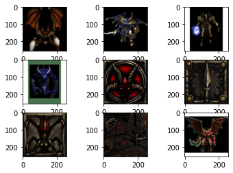

# diablo2-multimodal

Multimodal deep learning experiments on Diablo 2 data.

- **parse_and_build_dataset.ipynb** - Parse and build the dataset based on data crawled from diablo2.io.
- **clip_retrieval.ipynb** - Build indexes based on previous step and query it using https://github.com/rom1504/img2dataset and https://github.com/rom1504/clip-retrieval

## Samples

### Query "Helm, Shako, Green, Level 60"

### Query "Diablo"

## Data

Everything in data/ is raw downloaded data from diablo2.io, except "clean" which is the result of parsing the raw data.